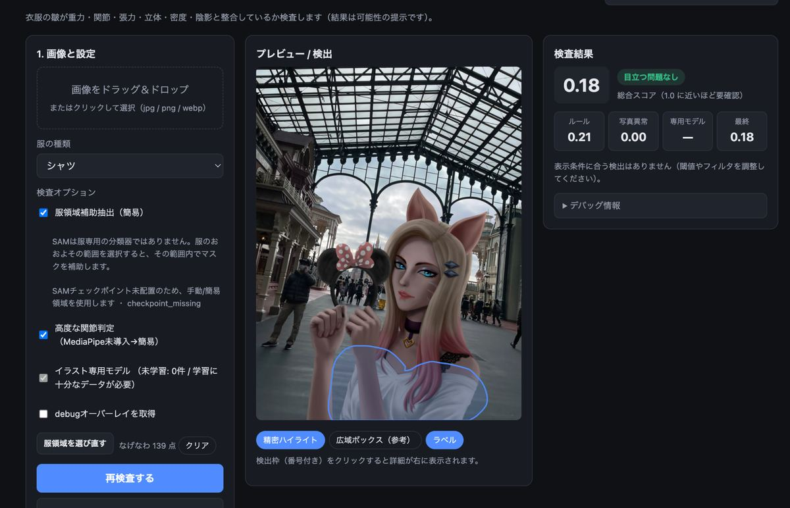
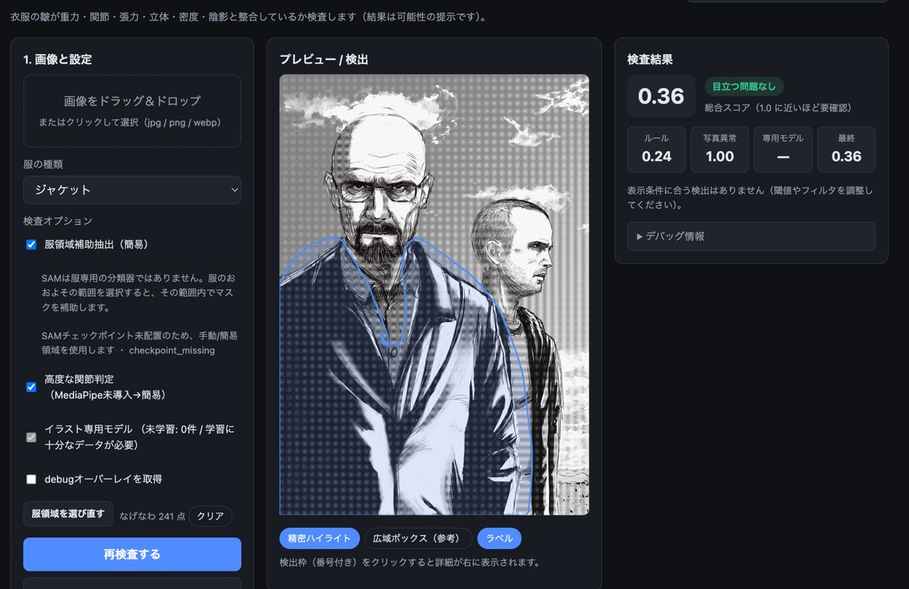
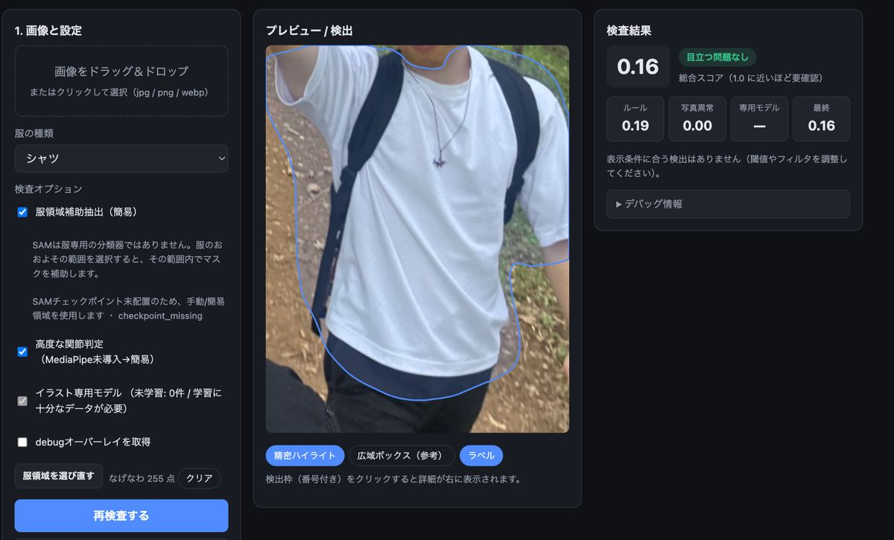
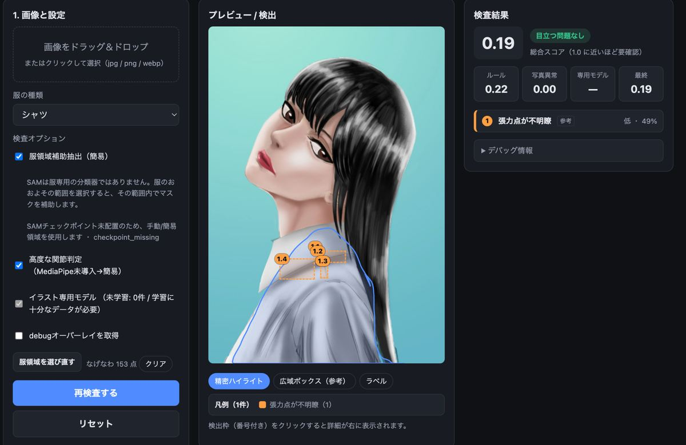
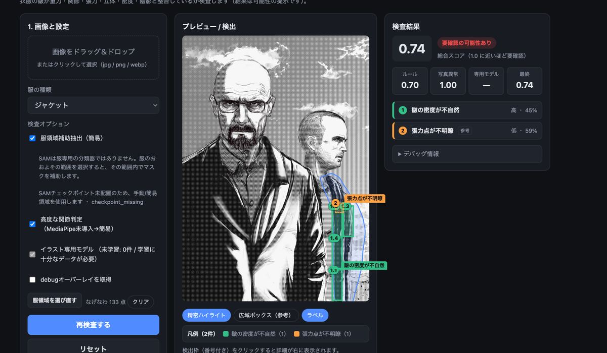
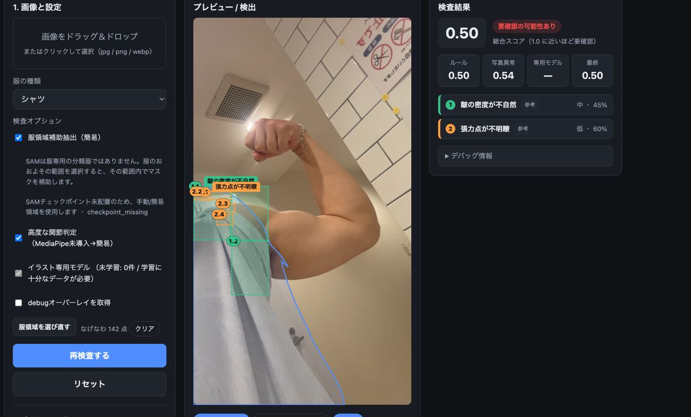
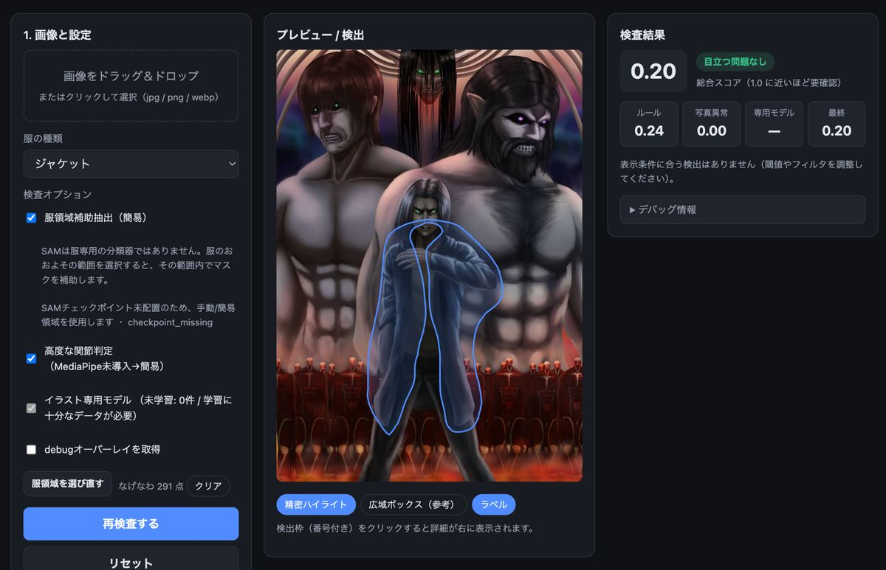

# Cloth Wrinkle Analyzer

イラスト中のキャラクター衣服に描かれた「不自然な皺」を検出する、作画支援Webアプリです。  
画像をアップロードし、服領域を指定すると、皺の方向・密度・人体構造との整合性などをもとに、修正候補を可視化します。

> 現在の状態: MVP  
> FastAPIバックエンド、Next.jsフロントエンド、画像処理ベースの皺検出、フィードバック保存、評価スクリプト、外部ツール向けAPIを実装済みです。SAMによる服領域の補助抽出（手動選択を起点）、MediaPipeによる関節判定の高度化、フィードバックを使ったイラスト専用モデル学習は、拡張機能として段階的に追加する構成です。

---

## 機能

### MVPの主な機能

- 画像アップロードによる皺検査
- 手動bboxによる服領域指定
- OpenCVベースの皺候補線抽出
- 6種類のissue検出
  - `gravity_inconsistency`: 重力方向と皺の流れの不整合
  - `joint_inconsistency`: 関節の曲がり方と皺の不整合
  - `tension_ambiguity`: 張力点が不明な皺
  - `body_volume_inconsistency`: 体の立体構造と合わない皺
  - `density_inconsistency`: 皺の密度の不自然さ
  - `shadow_wrinkle_mismatch`: 皺線と陰影の不一致
- issueごとのbbox、severity、confidence、説明文表示
- issue type / severity / score threshold によるフィルタリング
- ユーザーフィードバック保存
  - `correct`
  - `false_positive`
  - `wrong_location`
  - `wrong_reason`
  - `missed_issue`
- SQLiteによる検査履歴・フィードバック保存
- 外部ツール向けbase64 API
- Precision / Recall / F1を算出する評価スクリプト

### 機械学習・解析機能

- 実写服写真から皺特徴量を抽出
- Mahalanobis距離によるone-class anomaly model
- garment type別の正常パターンモデル
- `reference_stats.json` による線密度基準
- issue type / garment type別の判定閾値
- 将来的なDINOv2 / PatchCore / イラスト専用モデルへの差し替えを想定した構成

### 任意・実験的な拡張機能

- SAMによる服領域の補助抽出（手動選択を起点）
- MediaPipeによるpose推定
- フィードバックを使ったイラスト専用モデル学習
- Photoshop UXP Plugin連携

---

## 解析結果の例

以下は、アップロード画像に対して本アプリが行った解析結果の例です。  
服領域を指定したうえで、皺の密度・張力点・重力方向・立体構造との整合性などをもとに、不自然な可能性のある箇所を可視化しています。表示されるスコアや検出枠は、修正が必要な箇所を断定するものではなく、作画確認のための参考情報です。

### 目立つ問題が検出されなかった例



背景や人物を含む画像でも、指定した服領域に対して目立つ問題がない場合は、検出結果は表示されません。



服領域が広く指定されていても、スコアが閾値を下回る場合は「目立つ問題なし」として扱われます。



実写画像に対しても、皺の流れや密度が自然な範囲にある場合は、問題なしとして表示されます。

### 局所的な検出ハイライトの例



検出されたissueには番号付きのハイライトが表示され、右側の検査結果リストと対応します。ハイライトは画像全体ではなく、判定に寄与した局所領域を示します。



皺の密度が不自然な箇所や、張力点が不明瞭な箇所は、issue typeごとの色で表示されます。



現行MVPはルールベースと古典的画像処理を中心としているため、写真や複雑な背景では誤検出が発生する場合があります。検出結果は、ユーザーフィードバックによって `false_positive` や `wrong_location` として保存し、今後の精度改善に利用できます。

### 検出されない例



スコアが表示閾値を下回る場合、検出枠は表示されません。表示閾値を調整することで、参考レベルのissueも確認できます。

---

## 技術スタック

| 領域 | 使用技術 |
|---|---|
| フロントエンド | Next.js 14, React, TypeScript |
| バックエンド | FastAPI, Pydantic, SQLAlchemy, Uvicorn |
| 画像処理 | OpenCV, NumPy, scikit-image |
| 機械学習・評価 | NumPy, pandas, scikit-learn, joblib |
| 任意AI機能 | SAM, MediaPipe |
| データベース | SQLite |
| テスト | pytest, ruff |

---

## プロジェクト構成

```text
.
├── backend/
│   ├── app/
│   │   ├── main.py
│   │   ├── settings.py
│   │   ├── schemas.py
│   │   ├── routes/
│   │   ├── services/
│   │   └── db/
│   ├── tests/
│   └── requirements.txt
├── frontend/
│   ├── app/
│   ├── components/
│   └── lib/
├── ml/
│   ├── extract_photo_features.py
│   ├── train_anomaly_model.py
│   ├── evaluate_illustration_results.py
│   └── configs/
├── data/       # ローカルデータ用。Git管理外
├── reports/    # 評価レポート出力用。Git管理外
├── docker-compose.yml
├── CLAUDE.md
└── README.md
```

---

## クイックスタート

### 1. バックエンド

```bash
cd backend
python3 -m venv .venv
source .venv/bin/activate
pip install -r requirements.txt
uvicorn app.main:app --reload --port 8000
```

バックエンドURL:

```text
http://localhost:8000
```

確認用エンドポイント:

```text
http://localhost:8000/health
http://localhost:8000/docs
http://localhost:8000/api/model/status
```

---

### 2. フロントエンド

```bash
cd frontend
cp .env.local.example .env.local
npm install
npm run dev
```

フロントエンドURL:

```text
http://localhost:3000
```

`frontend/.env.local` の例:

```env
NEXT_PUBLIC_API_BASE=http://localhost:8000
```

---

## 参照モデルの学習

現在の異常検知モデルは、実写服写真から抽出した皺特徴量をもとに学習します。

### データセット配置

参照用の実写服写真は、以下の形式で配置します。

```text
data/photos_raw/<garment>/<dataset_name>/image.jpg
```

使用できるgarment type:

```text
shirt
skirt
pants
dress
jacket
```

例:

```text
data/photos_raw/pants/openimages_v7_val/sample_001.jpg
data/photos_raw/jacket/openimages_v7_val/sample_002.jpg
```

### 特徴量抽出

```bash
python ml/extract_photo_features.py   --photos-root data/photos_raw   --masks-root data/photos_masks   --output-path data/features/photo_reference_features.parquet   --reference-stats-path data/features/reference_stats.json
```

parquet保存に必要なライブラリがない場合、CSVにフォールバックすることがあります。

### 異常検知モデルの学習

```bash
python ml/train_anomaly_model.py   --features data/features/photo_reference_features.csv   --output data/models/anomaly_model.json
```

`data/models/anomaly_model.json` が存在する場合、バックエンドは起動時に自動で読み込みます。  
モデルがない場合は、ルールベース判定にフォールバックします。

---

## API概要

### `POST /api/inspect-wrinkle`

multipart形式で画像を送信して検査します。

| Field | Type | Required | Description |
|---|---|:---:|---|
| `image` | file | yes | jpg / png / webp |
| `garment_type` | string | no | `shirt`, `skirt`, `pants`, `dress`, `jacket`, `unknown` |
| `selected_region` | JSON string | no | `{"x":100,"y":200,"w":300,"h":400}` |

例:

```bash
curl -F "image=@your_illustration.png"      -F "garment_type=skirt"      -F 'selected_region={"x":40,"y":60,"w":200,"h":300}'      http://localhost:8000/api/inspect-wrinkle
```

---

### `POST /api/inspect-base64`

Photoshop Pluginなどの外部ツールから利用しやすい、JSON形式の検査APIです。

```json
{
  "image_base64": "data:image/png;base64,...",
  "garment_type": "shirt",
  "selected_region": {"x": 0, "y": 0, "w": 100, "h": 100},
  "source": "web"
}
```

---

### `GET /api/model/status`

現在読み込まれているモデルや設定の状態を返します。

```json
{
  "model_loaded": true,
  "model_type": "mahalanobis",
  "reference_stats_loaded": true,
  "thresholds_loaded": true,
  "available_garment_models": ["global", "shirt", "skirt", "pants", "dress", "jacket"]
}
```

---

### `POST /api/feedback`

ユーザーの修正・評価フィードバックを保存します。保存されたデータは、将来的な評価やイラスト専用モデルの学習に利用できます。

```json
{
  "inspection_id": "...",
  "issue_id": "joint_inconsistency-0",
  "feedback": "false_positive",
  "garment_type": "shirt",
  "issue_type": "joint_inconsistency",
  "corrected_bbox": {"x": 120, "y": 200, "w": 80, "h": 60},
  "comment": "この皺は自然な表現です。"
}
```

---

## 評価

評価用アノテーションを以下に用意します。

```text
data/annotations/illustration_feedback.csv
```

評価スクリプトを実行します。

```bash
python ml/evaluate_illustration_results.py   --images-root data/illustrations_raw   --annotations data/annotations/illustration_feedback.csv   --output-md reports/evaluation_report.md   --output-json reports/evaluation_metrics.json   --iou-threshold 0.3
```

出力される主な評価内容:

- Precision
- Recall
- F1
- issue type別の評価指標
- garment type別の評価指標
- false positive一覧
- false negative一覧
- wrong location / wrong reasonの一覧

---

## 任意機能: SAMによる服領域の補助抽出

SAMは「服専用の分類器」ではなく、領域を補助する**プロンプト型のセグメンテーション**です。
画像全体から服だけを自動で確実に切り出すものではありません（box promptの範囲内にある
人物・肌・髪などを含むことがあります）。本アプリでは、ユーザーの手動選択を起点とした
**領域の補助**として使います。

推奨MVPフロー:

1. ユーザーが服のおおよその範囲を手動で選択（bbox / なげなわ）
2. その選択範囲をSAMの **box prompt** として使用
3. SAMが選択範囲内で領域マスクを補助的に精緻化
4. そのマスク内**だけ**で皺候補線を抽出（マスク外・境界付近・長すぎる輪郭線は除外）

これにより、髪・輪郭線・背景線・ハッチングなどによる誤検出を減らせます。SAMが使えない場合や
マスクが不安定（面積比が閾値外）な場合は、手動選択領域へ自動でフォールバックします。
（服クラスそのものを切り出したい場合は、将来的にhuman parsing系モデルの併用を想定。）

### ローカル設定

```bash
cd backend
source .venv/bin/activate
pip install -r requirements-sam.txt
mkdir -p ../data/models/sam
```

SAM checkpointを以下に配置します。

```text
data/models/sam/sam_vit_b_01ec64.pth
```

環境変数を設定します。

```bash
export WRINKLE_SEGMENTATION_PROVIDER=sam
export WRINKLE_ENABLE_AUTO_SEGMENTATION=true
export WRINKLE_SAM_CHECKPOINT_PATH=../data/models/sam/sam_vit_b_01ec64.pth
export WRINKLE_SAM_MODEL_TYPE=vit_b
export WRINKLE_SAM_DEVICE=cpu
```

状態確認:

```bash
curl http://localhost:8000/api/model/status
```

> SAM checkpointファイルはGitHubにコミットしません。

### デプロイ時の注意（SAM）

- **メモリ**: vit_b をCPUで動かすには概ね **2〜4GB RAM** を見込んでください
  （無料/極小インスタンスはOOMの恐れ）。
- **ウォームアップ（任意）**: `WRINKLE_SAM_LAZY_LOAD=true` だと初回検査でモデルを
  ロードするため最初のリクエストが遅くなります。プラットフォームのリクエスト
  タイムアウトを避けたい場合は、起動直後に1回ダミー検査を投げてウォームアップしてください。
- **チェックポイントの完全性**: `WRINKLE_SAM_AUTO_DOWNLOAD` を使う場合は、取得した
  `.pth` のSHA-256などを検証してから利用してください（信頼できないファイルを
  `torch.load` しない）。本番では事前にPersistent Diskへ配置する方法を推奨します。

---

## 追加機能: フィードバックを使ったイラスト専用モデル

保存されたフィードバックデータから、イラスト向けの学習データセットを作成できます。

```bash
python ml/build_illustration_feedback_dataset.py   --db data/wrinkle.db   --images-root data/illustrations_raw   --output-root data/illustration_feedback_dataset
```

軽量な分類器を学習します。

```bash
python ml/train_illustration_feedback_model.py   --features data/illustration_feedback_dataset/features.csv   --output-model data/models/illustration_feedback_model.joblib
```

このモデルは、誤検出の削減や、イラスト特有の線画表現への適応を目的としています。

---

### 環境変数

バックエンド:

```env
WRINKLE_CORS_ORIGINS=https://your-frontend.vercel.app
WRINKLE_DATA_DIR=/var/data
WRINKLE_SEGMENTATION_PROVIDER=sam
WRINKLE_ENABLE_AUTO_SEGMENTATION=true
WRINKLE_SAM_CHECKPOINT_PATH=/var/data/models/sam/sam_vit_b_01ec64.pth
WRINKLE_SAM_MODEL_TYPE=vit_b
WRINKLE_SAM_DEVICE=cpu
```

フロントエンド:

```env
NEXT_PUBLIC_API_BASE=https://your-backend.example.com
```

### Docker

```bash
docker compose up --build
```

SAM対応のバックエンドをビルドする場合:

```bash
docker build --build-arg INSTALL_SAM=true -t wrinkle-backend ./backend
```

SAM checkpointファイルはDocker imageに含めず、volume mountで渡してください。

---

## データとGit管理

以下のファイル・ディレクトリはGitHubにコミットしません。

```text
data/illustrations_raw/
data/uploads/
data/outputs/
data/photos_raw/
data/photos_masks/
data/features/
data/models/
data/segmentation_cache/
data/*.json
data/*.csv
data/*.parquet
models/
*.pth
*.pt
*.onnx
*.joblib
reports/
external/
.dataset_venv/
backend/.venv/
frontend/node_modules/
frontend/.next/
```

すでにローカルデータをGitに追加してしまった場合:

```bash
git rm -r --cached data/illustrations_raw
git rm -r --cached data/photos_raw
git rm -r --cached data/features
git rm -r --cached data/models
git rm -r --cached reports
git commit -m "chore: stop tracking generated files and local data"
```

---

## 現在の制限

- 現在のMVPは、完全な深層学習ベースの検出器ではありません。
- 精度は、服領域の指定精度に大きく影響されます。
- 実写写真由来の参照特徴量は、イラスト線画と完全には一致しません。
- SAMやMediaPipeは任意機能であり、スタイル化されたイラストでは失敗する場合があります。
- フィードバック学習は、十分なラベル付きデータが集まるまでは効果が限定的です。
- SQLiteはデモ用途には使えますが、本番環境でフィードバックを永続保存する場合はPostgreSQLなどの利用を推奨します。

---

## ロードマップ

- 服パース（human parsing）による服クラス抽出の導入（SAMは領域補助）
- MediaPipeによる関節判定の高度化
- 蓄積フィードバックを使ったイラスト専用モデル学習
- DINOv2 / PatchCoreによる異常検知
- Photoshop UXP Plugin連携
- モデルバージョン管理と評価ダッシュボード

---

## AI開発支援メモ

Claude Codeなどの開発エージェント向けの作業指針は [`CLAUDE.md`](./CLAUDE.md) を参照してください。

---

## ライセンス

ライセンスはまだ設定していません。
